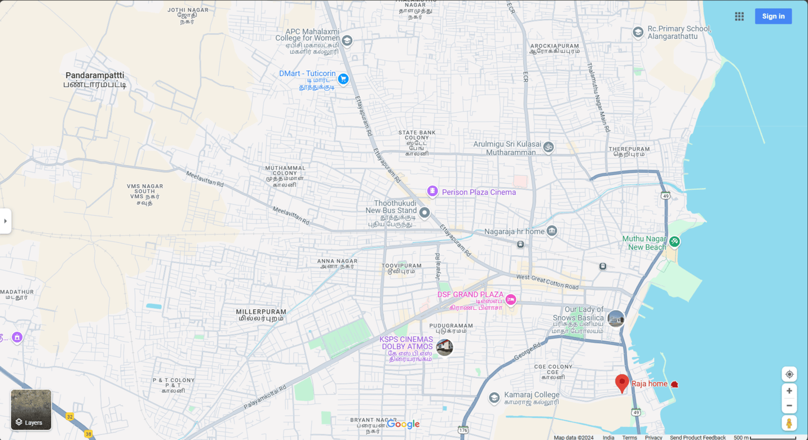

# Ex04 Places Around Me
## Date: 23.11.2024

## AIM
To develop a website to display details about the places around my house.

## DESIGN STEPS

### STEP 1
Create a Django admin interface.

### STEP 2
Download your city map from Google.

### STEP 3
Using ```<map>``` tag name the map.

### STEP 4
Create clickable regions in the image using ```<area>``` tag.

### STEP 5
Write HTML programs for all the regions identified.

### STEP 6
Execute the programs and publish them.

## CODE
nearme.html
```
<html>
    <head>
        <title>Near Me</title>
        <style>
			body {
				font-family: arial;
                align-items: center;
			}
            .mapimg {
                border-radius: 15px;
                box-shadow: 0px 0px 30px rgb(32, 32, 32);
                width: 1433px;
            }
        </style>
    </head>
    <body>
		<h1 align = "center">Thoothukudi - City</h1>
        <h2 align = "center">S Rajath (24900186)</h2>
        <center></center>
        <map name="landmarks">
            <area target="_blank" alt="D-Mart" title="D-Mart" href="dmart.html" coords="449,103,658,182" shape="rect">
            <area target="_blank" alt="KSPS-Cinemas" title="KSPS-Cinemas" href="ksps.html" coords="675,563,749,576,823,597,803,652,727,663,656,660,639,602" shape="poly">
            <area target="_blank" alt="Kamaraj-College" title="Kamaraj-College" href="kamarajcollege.html" coords="930,709,96" shape="circle">
            <area target="_blank" alt="Thoothukudi-New-Bus-Stand" title="Thoothukudi-New-Bus-Stand" href="newbusstand.html" coords="632,334,780,431" shape="rect">
            <area target="_blank" alt="RC-School" title="RC-School" href="rcschool.html" coords="1088,16,1298,100" shape="rect">
        </map>
    </body>
</html>
```
dmart.html
```
<html>
    <head>
        <title>D Mart</title>
        <style>
            body {
                background-color: #37a41e;
                font-family: arial;
                text-align: center;
                color: #ffffff;
                line-height: 47px;
                font-size: 30px
            }
            h1 {
                margin-top: 30px;
            }
            p {
                margin-top: 30px;
                width: 80%;
            }

            .content {
                margin: 100px;
            }
        </style>
    </head>
    <body>
        <h1>D Mart</h1>
        <hr color="#ffffff" size="7px">
        <p class="content">It is a great supermarket for purchasing any items at affordable price with good parking facilities.
            <br>
            People mostly prefers buying here for their convinience.
        </p>
    </body>
</html>
```
kamarajcollege.html
```
<html>
    <head>
        <title>Kamaraj College</title>
        <style>
            body {
                background-color: #0764b5;
                font-family: arial;
                text-align: center;
                color: #ffffff;
                line-height: 47px;
                font-size: 30px
            }
            h1 {
                margin-top: 30px;
            }
            p {
                margin-top: 30px;
            }
            .content {
                margin: 100px;
            }
        </style>
    </head>
    <body>
        <h1>Kamaraj College</h1>
        <hr color="#ffffff" size="7px">
        <p class="content">Kamaraj College, located in Thoothukudi, is a prestigious educational institution known for its excellent infrastructure, modern classrooms, and well-equipped laboratories.
            <br>
            The college encourages students to participate in extracurricular activities like sports and cultural events, helping them develop their overall personality.
        </p>
    </body>
</html>
```
ksps.html
```
<html>
    <head>
        <title>KSPS Cinemas Dolby Atmos</title>
        <style>
            body {
                background-color: #ffe600;
                font-family: arial;
                text-align: center;
                color: #000000;
                line-height: 47px;
                font-size: 30px
            }
            .title {
                margin-top: 30px;
                font-size: 60px;
                font-weight: bolder;
            }
            p {
                margin-top: 30px;
            }

            .content {
                margin: 100px;
            }

            .s {
                color: #000000;
            }
        </style>
    </head>
    <body>
        <p class="title">KSPS Cinemas <span class="s">Dolby</span> Atmos</h1>
        <hr color="#000000" size="7px">
        <p class="content">KSPS Ganapathy Kalaiarangam, located in Thoothukudi, is a popular cinema hall known for its state-of-the-art 4K 3D Dolby Atmos sound system, providing an immersive movie-watching experience.
            <br>
            The theater offers a variety of regional, Bollywood, and Hollywood movies, making it a favorite spot for movie buffs in the area.
        </p>
    </body>
</html>
```
newbusstand.html
```
<html>
    <head>
        <title>Thoothukudi New Bus Stand</title>
        <style>
            body {
                background-color: #ab3c1a;
                font-family: arial;
                text-align: center;
                color: #edcd16;
                line-height: 47px;
                font-size: 30px
            }
            h1 {
                margin-top: 30px;
            }
            p {
                margin-top: 30px;
            }
            .content {
                margin: 100px;
            }
        </style>
    </head>
    <body>
        <h1>Thoothukudi New Bus Stand</h1>
        <hr color="#edcd16" size="7px">
        <p class="content">The newly renovated Thoothukudi Perarignar Anna bus stand, opened under the Smart Cities Mission scheme, boasts modern facilities and can accommodate 29 buses simultaneously.
            <br>
        </p>
    </body>
</html>
```
rcschool.html
```
<html>
    <head>
        <title>RCS Primary School</title>
        <style>
            body {
                background-color: #470a92;
                font-family: arial;
                text-align: center;
                color: #000000;
                line-height: 47px;
                font-size: 30px
            }
            h1 {
                margin-top: 30px;
            }
            p {
                margin-top: 30px;
            }
            .content {
                margin: 100px;
            }
        </style>
    </head>
    <body>
        <h1>RCS Primary School</h1>
        <hr color="#000000" size="7px">
        <p class="content">R.C.S. Primary School in Thoothukudi is renowned for its commitment to providing quality education with a focus on holistic development.
            <br>
            The school offers a nurturing environment, modern facilities, and a dedicated faculty, ensuring that students receive a well-rounded education.
        </p>
    </body>
</html>
```

## OUTPUT

 
 
 
 
 
 


## RESULT
The program for implementing image maps using HTML is executed successfully.
